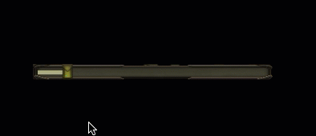
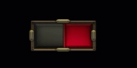
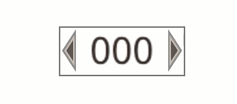

# Python Arcade UI Examples

This repository contains my experiments with the arcade ui.

## Examples

|    Folder     |               Demo               |
|:-------------:|:--------------------------------:|
| image_slider  |   |
| simple_button |  |
|    toggle     |         |
|   int_field   |      |

